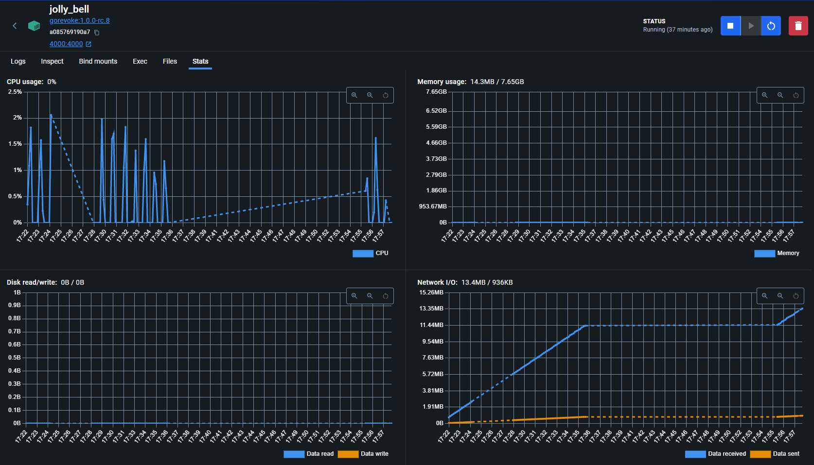

# GoRevoke

<!-- PROJECT SHIELDS -->


## Overview

GoRevoke is a standalone [Certificate Revocation List](https://en.wikipedia.org/wiki/Certificate_revocation_list) Distrution Point written in [Go](https://go.dev/), designed to be lightweight and fully self-contained. Using a simple configuration, GoRevoke automates downloading and serving of remote CRLs. GoRevoke is based on, [revoke](https://github.com/acavella/revoke), a shell based script providing similar function.

### Key Features

- Cross-platform compatiblity; tested on Linux and Windows
- Native and containerized deployment options
- Retrieve remote CRL data via HTTP or HTTPS
- Validation and confirmation of CRL data
- Built-in webserver alleviates the need for additional servers
- Ability to retrieve and serve an unlimited number of CRL sources
- Support for full and delta CRLs

### Planned Features

- OCSP responder

## Installation Instructions

GoRevoke can be deployed as either a containerized image or installed natively on the host. The following instructions outline basic installation and configuration options.

### Docker Deployment

1. On the host machine create the following directories: `${PWD}/appdata/gorevoke/conf` and `${PWD}/appdata/gorevoke/crl`
2. Copy and rename the configuration example `conf/config.yml.example` to `${PWD}/appdata/gorevoke/conf/config.yml`
3. Pull the latest image from Docker Hub using the following example Docker run command:
```Shell
docker run -d \
--name gorevoke \
-p 80:4000 \
-v ${PWD}/appdata/gorevoke/crl:/usr/local/bin/gorevoke/crl/static \
-v ${PWD}/appdata/gorevoke/config:/usr/local/bin/gorevoke/conf \
--restart=unless-stopped \
s0lution/gorevoke:latest
```

> [!IMPORTANT]
> The Docker Run command above exposes the built-in webserver to the host directly on port 80 and is not recommended for production deploys. For a production configuration we recommend placing a webserver or proxy (such as Apache httpd or nginx) in front of GoRevoke to handle public web requests.

### Native Deployment

```Text
Installation instructions here.
```

## Container Performance


## Security Vulnerabilities

I welcome welcome all responsible disclosures. Please do not open an ISSUE to report a security problem. Please use the private reporting system to report security related issues responsibly: https://github.com/acavella/gorevoke/security/advisories/new

## Contributing

Contributions are what make the open source community such an amazing place to be learn, inspire, and create. Any contributions you make are **greatly appreciated**.

1. Fork the Project
2. Create your Feature Branch (`git checkout -b feature/AmazingFeature`)
3. Commit your Changes (`git commit -m 'Add some AmazingFeature`)
4. Push to the Branch (`git push origin feature/AmazingFeature`)
5. Open a Pull Request

## License

Distributed under the MIT License. See `LICENSE` for more information.

## Contact

Tony Cavella - tony@cavella.com

Project Link: [https://github.com/acavella/gorevoke](https://github.com/acavella/gorevoke)

<!-- ACKNOWLEDGEMENTS -->
## Acknowledgements

